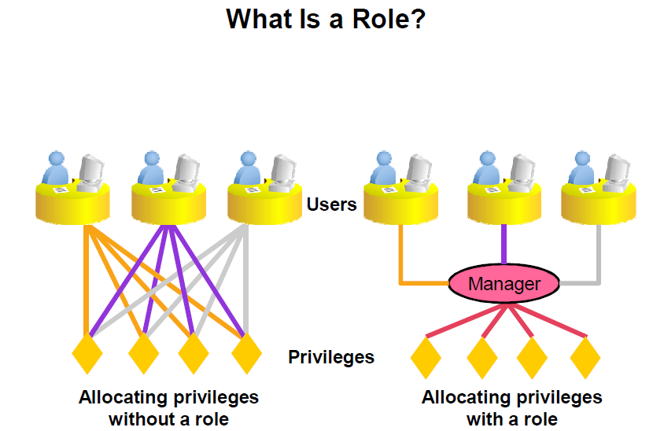
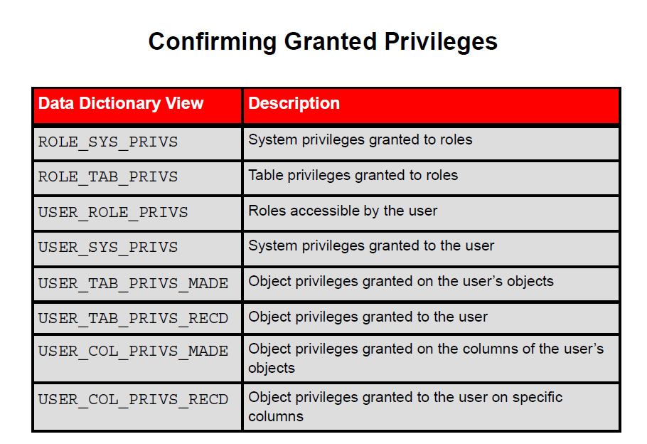

 Administering User Security Part 2

# Administering User Security Part 2 

## Role
A role is a named group of related privileages that can be granted to the user. This method makes it easier to revoke and maintain privileges.

A user can have access to several roles, and several users can be assigned the same role.

Roles are typlically  created for database application.



## Creating and Granting Privileges to a Role

- Create a Role
`CREATE ROLE manager;`

- Grant privileges to arole
`GRANT create table, create view TO manager;`

- Grant a Role to a users
`GRANT manager to john;`

## Object Privileges

An object privilege is a privilege or right to perform a particular action on a specific table, view, sequence, or procedure.

- Object privileges vary from object to object.
- An owner has all the privileges on the object
- An owner can give specific privileges on that owners object.



## Practice SQL

Prerequiste :
- Instance is up and running
- Listener is up and running
- Pluggable database `orclpdb` is in open mode

```
--con as sysdba
show con_name

alter session set container=orclpdb;

show con_name

create role manager;

grant create table, create view, create sequence
to manager;

SELECT * FROM ROLE_SYS_PRIVS
WHERE ROLE='MANAGER';

---------------------------
CREATE USER john identified by john123;

grant create session to john;

grant unlimited tablespace to john;


grant manager to john;
------------------------------

CREATE ROLE QONLY;

GRANT SELECT ANY TABLE TO QONLY;

GRANT QONLY TO john;

CREATE ROLE IUD_EMP;

GRANT INSERT,UPDATE, DELETE
ON
HR.EMPLOYEES
TO IUD_EMP;


GRANT IUD_EMP TO john;


SELECT * FROM ROLE_TAB_PRIVS
WHERE ROLE='IUD_EMP'
```
## Practice SQL as user : john

```
--USER john CONNECTION

select * from session_privs;     

select * from user_sys_privs;

select * from user_role_privs;

select * from role_sys_privs;

SELECT * FROM ROLE_TAB_PRIVS
WHERE ROLE='IUD_EMP'

create table studnet
( student_id number,
  studnet_name varchar2(100)
);

grant select on
studnet to public; 

select * from hr.locations

select * from demo.emp

update hr.employees
set salary=salary+10
where employee_id=100;
```