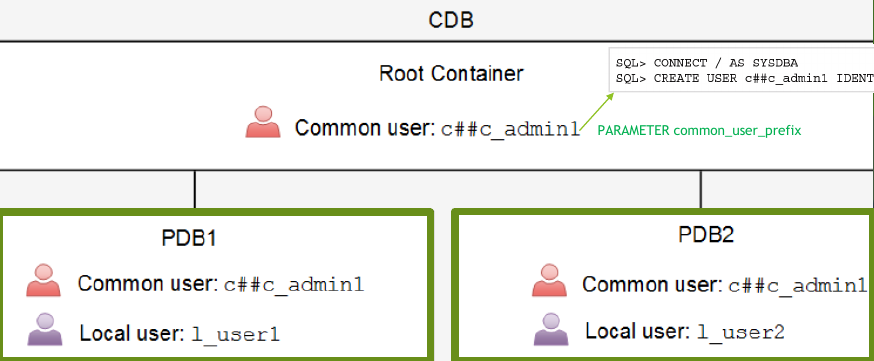
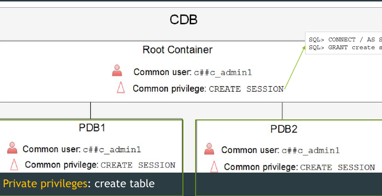

 Administering User Security Part 3

#  Administering User Security Part 3 


## Common users VS local users





## Common privileges VS local privileges




 
 ## Revoking Object Privileges
 
 - You use the REVOKE statement to revoke privileges granted to other users.
 - Privileges granted to others through the WITH GRANT OPTION
`REVOKE {privilege [,privilege ],  ALL} 
ON OBJECT 
FROM {user [,user...], role, public}
`

```
REVOKE select, insert 
ON departments 
FROm demo;

```

## SQL Excercise  1

```sql

show con_name

--make sure that all pluggable is opned
select con_id,name,open_mode from v$pdbs;

alter pluggable database all open;


select username,common,con_id from cdb_users
order by username;

select distinct(username) from cdb_users
where common='YES';


select username,common,con_id from cdb_users
where common='NO'
order by username;


SHOW PARAMETER common_user_prefix;

CREATE USER t1 IDentified by t1;

CREATE USER C##t1 IDentified by welcome;

select distinct(username) from cdb_users
where common='YES';

alter session set container=orclpdb;

show con_name;

create user carter identified by carter123 ;

select username,common,con_id from cdb_users
where common='NO'
order by username;

```

## SQL Excerice 2

```plsql
show con_name

--all roles in root are common
select * from dba_roles;

--you can not create local role in the root

create role test_role ;

show parameter common_user_prefix;

create role c##test_role container=all; 

grant create session to c##test_role container=all ;
grant create table to c##test_role container=all ;

create user c##dark identified by dark ;

grant c##test_role to c##dark container=all;

--now test the connection using sql developer 


create user c##kim identified by kim;

alter session set container=orclpdb;

grant c##test_role to c##kim;
--now c##kim only can create session in orclpdb


```