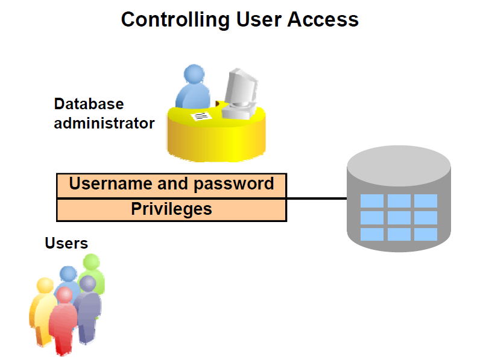

Administering User Security

# Administering User Security



- Database Security
	- System Security
	- Data Security
- System Privileges : Performing a particular action within the database
- Object Privileges : Manipulating the content of database objects
- Schemas : Collections of Objects such as tables, views and sequences
- users and schemas are database users , but when the user has objects then we call it schema  

## System Privileges
- More than 200 privileges are available
- The database administrator has high level system privileges for tasks such as 
	- Creating new users
	- Removing users
	- Removing tables
	- Backing up the tables
- The table : SYSTEM_PRIVILEGE_MAP contains all system privileges available based on the databse release.
- Eg : CREATE SESSION, CREATE TABLE, CREATE SEQUENCE, CREATE VIEW, CREATE PROCEDURE

## Creating Users

The DBA creates users with CREATE USER Statement

`CREATE USER <username> identified by <password>;`

After a user is created , the DBA can grant specific system privileges to that user.

`GRANT privilege [, privilege...] TO <username> [user, role, public...]; `

An Application developer, for example , may have the following system privileges:
- CREATE SESSION
- CREATE TABLE 
- CREATE SEQUENCE
- CREATE VIEW
- CREATE PROCEDURE

## Practice Queries
```sql

--1 you have to connect sys as sysdba
--2 when the DBA connect, it will be on root container db

show con_name

-- set the session as pdb - orclpdb

alter session set container=orclpdb

show con_name

select username,account_status,common from dba_users;

--to see the privilage map

select * from SYSTEM_PRIVILEGE_MAP

--now lets create new user called demo

--this will create user demo with password demo1234

create user demo identified by demo1234; 

-- Note that the user demo cannot login yet

--now these some sys priv

grant create session to demo;

grant create table to demo;

-- you can do this also : grant create session,create table to demo

GRANT UNLIMITED TABLESPACE TO DEMO;

grant create sequence to DEMO;

grant create view to demo;

grant create synonym to demo;
---------------------------------------------------------------------------
--now these some object priv

grant select on hr.employees to demo;

grant delete on hr.employees to demo;

grant update (salary)  on hr.employees to demo;

grant all on hr.locations to demo;

grant select, insert on hr.jobs to demo;

grant select  on hr.countries to public;
```
### SQL Practice as Demo user
```
-- now connect to demo and do all the next

-- the user demo can know his privileges by using this query

select * from session_privs;

--now if he have create table privileges then he can insert,update,delete,  select, alter, index on any table he create


create table emp
( empid number constraint emp_pk primary key,
  ename varchar2(100)
);


insert into emp values (1,'khaled');

select * from emp;

alter table emp add (salary number);

select * from emp;

create sequence emp_s;

--he can create index for the table he create 

create index ename_ind on emp (ename);

create or replace view emp_v
as select empid, ename
from emp;

--now the user demo he want to change his password , because the dba create for  his default password demo1234

alter user demo identified by demo_green;

select * from hr.employees;

--the demo user can make select * from employees without hr. only if there is public syonym for hr.employees

select * from all_synonyms where table_name='EMPLOYEES'

update hr.employees
set department_id =null
where employee_id=1;

update hr.employees
set salary =500
where employee_id=1;

select * from session_privs;

select * from user_sys_privs;


select * from user_tab_privs_recd
order by 2;

select * from user_col_privs_recd;

grant select on emp to hr;

select * from user_tab_privs_made;

grant update (ename) on emp to hr;

select * from user_col_privs_made;


```