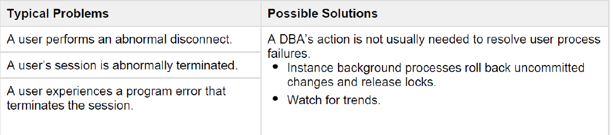

Back Up and Recovery

# Back Up and Recovery

## DBA Responsibilities

-  Protect the database from failure wherever possible
- Increase the mean time between failures (MTBF)
  - Ensures that hardware is as reliable as possible.
  - operating system maintenance is performed in a timely manner.
  - advanced configuration options ( RAK and Oracle Data Guard )
- Protect critical components by using redundancy
- Decrease the mean  time to recover (MTTR)
  - practicing recovery procedures in advance and configuring backups, so that they are readily available when needed
- Minimize the loss of data
  - Archive log files
  - Flashback technology

## Categories of Failure

* Statement failure : A single database operation (select, insert, update, or delete) fails.
* User process failure : A single database session fails.
* Network failure : Connectivity to the database is lost.
* User error : A user successfully completes an operation, but the operation (dropping a table or entering bad data) is incorrect.
* Instance failure : The database instance shuts down unexpectedly.
* Media failure : A loss of any file that is needed for database operation (that is, the files have been deleted or the disk has failed).

### Statement Failure


### User Process Failure



### Network Failure


### Instance Failure


### User Error


### Media Failure


## Incomplete vs. Complete Recovery.

- Both terms are used to describe different methods of recovering the database from media failure
  That is when you lose actual database data files and not just restart your Oracle instance after it has crashed.
- complete recovery: you bring your database to the state where it is fully up to date
  including all completed transactions and database modifications up to the present date and time.
- incomplete recovery which brings your database to a specific point in time in the test.
  This is also known as point in time recovery, or PITR

## Redo logs and Archived Redo logs

* Oracle redo logs contain a log of all transactions which have been applied to your Oracle database.
  Every single insert, delete, or update statement is recorded in the redo logs.
* The Oracle database requires at least two Redo Log Files at any given time, as it writes to them
  in a cyclic manner.
* The database writes to the first Redo Log File, and once that Redo Log File is filled up, the database will start writing to the second Redo Log File. This is called a Redo Log switch


The archiver process is very straightforward. It is responsible to copy the Oracle redo log files to a remote storage device after a redo log switch has occurred. The archiver process will copy the redo log file and place it on any external storage of your choosing.


## Prerequisites of point-in-time-recovery
In order for us to be able and perform point-in-time-recovery, using a combination of database backups and database archived read logs, there's several prerequisites and configuration options we need to configure
- we need to make sure our Oracle database is set to ARCHIVELOG mode. you can execute this command ARCHIVE LOG LIST; 
	- It should give you that: Automatic archival : Enabled
- you will also need to have a database backup of all your data files from before the target SCN, or time stamp to which you want to restore your database to. for example, if you want to restore your database to 12PM you will need a full database backup that was completed before 12 PM
- you will need to make sure that you have all of the archived read logs the database generated

## Oracle Backup Technologies

 - **User Managed Hot Back Up**
The DBA takes periodic backups of the database data files and review logs using operating system commands. 

- **Oracle Recovey Manager (RMAN)**
is a command-line utility that can take database backups for you, and also manage your database backups and perform database recovery (supports incremental database backups) .

- **Data Pump**
Database export-import utility. (it creates logical exports of your database)


## Enabling ARCHIVELOG mode
 - When Archive mode is enabled, Oracle turns each active redo log file into an archived redo log file when it finishes writing to it.
- Archive mode is essential for running online or hot backups in Oracle, as well as for enabling Oracle's Flashback Database technologies.

```
 -- Connect sys as sysdba
 
-- Make sure you are in the root
 
 -- Do this: 
 
 ARCHIVE LOG LIST; 
 
 -- to see if option is enabled or no , If not then

Shutdown immediate;
STARTUP MOUNT;
ALTER DATABASE archivelog;
ALTER DATABASE OPEN;
ALTER PLUGGABLE DATABASE ALL OPEN;
```

## Configuring fast recovery area
- The fast recovery area is an Oracle managed directory file system, or Oracle automatic storage management disk group that provides centralized storage for backup and recovery files.
- The fast recovery area is usually used to store the Oracle archived redo logs, the database flashback change logs and RMAN backup sets
- Two parameters control the fast recovery area.
1. db_recovery_file_dest
2. db_recovery_file_dest_size

```
Alter system set DB_RECOVERY_FILE_DEST_SIZE = 20G;
Alter system set DB_RECOVERY_FILE_DEST '/u01/app/oracle/fast_recovery_area';
```