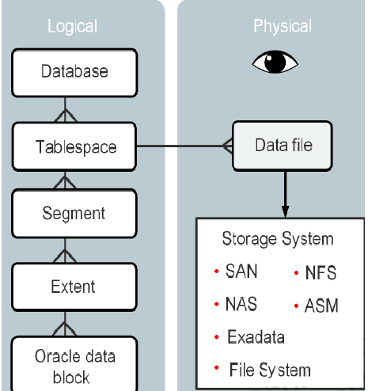
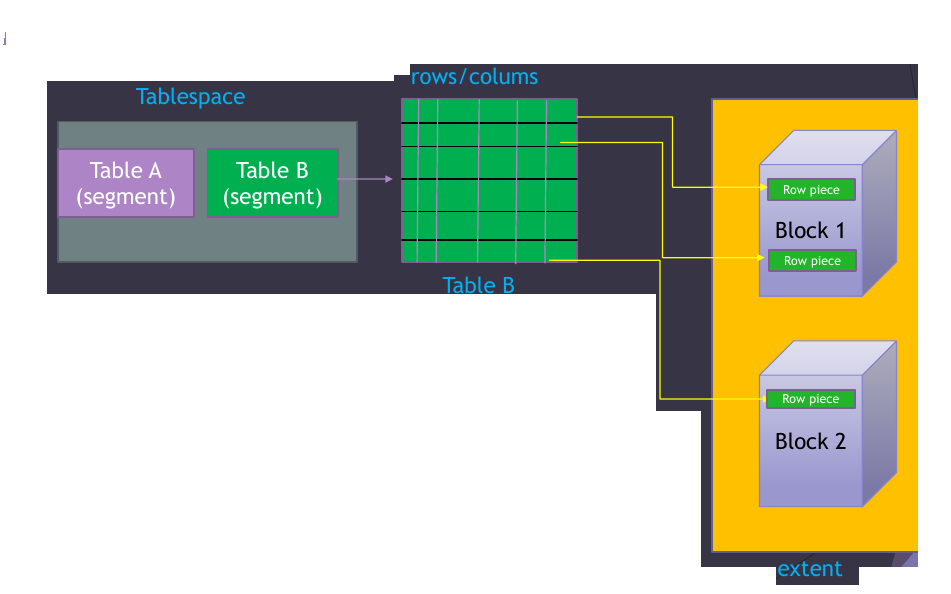

Creating and Managing Tablespace 

# Creating and Managing Tablespace 

- Tablespaces are logical storage groups that can be used to store logical database constructs, such as tables and indexes. Logically it stores the database files
- A Segment is a set of Extents, one or more Extents, allocated for certain logical structures inside the database ( ex: table, index)
- An Extent is a set of contiguous Oracle Data Blocks it is much more efficient, when allocating space
- Oracle data stored in DB blocks. 1 Block= 8 K by default. A single Oracle Data Block contains one or more rows

### SYSTEM tablespace
- Used for core functionality.
- Stores the data dictionary ( belong to sys schema).
- Oracle create system tablespace automatically when the database is created.
- you cannot rename or drop the SYSTEM tablespace. 
### SYSAUX tablespace
- The SYSAUX tablespace is an auxiliary tablespace to the SYSTEM tablespace.
- It reduces the load on the SYSTEM tablespace.
- Oracle create it automatically when the database is created
- you cannot rename or drop the SYSAUX tablespace.
### TEMP tablespace
- are used to manage space for database sort and joining operations and for storing global temporary tables.
- Other SQL operations that might require disk sorting are: CREATE INDEX, ANALYZE,SELECT DISTINCT, ORDER BY, GROUP BY, UNION, INTERSECT, MINUS,...

### UNDO tablespace
is used to roll back, or undo, changes to the database.
- Roll back transactions when a ROLLBACK statement is issued
- Recover the database
- Provide read consistency

### USERS tablespace
- Stores users objects and data
- every database should have a tablespace for permanent user data that is assigned to users. Otherwise, user objects will be created in the SYSTEM tablespace, which is not good practice.
- In the preconfigured database, USERS is designated as the default tablespace for all new users.

-  If an entire row can be inserted into a single data block, then Oracle stores the row as one row piece.
- if all of a row's data cannot be inserted into a single data block or if an update to an existing row causes the row to outgrow its data block, then Oracle stores the row using multiple row pieces -A data block usually contains only one row piece for each row.
- When Oracle must store a row in more than one row piece, it is chained across multiple blocks.

## About creating tablespace

- Creating tablespace is an allocation of space in the DB that can contain schema objects.
- We can do this by create tablespace statement or EM express .
- We can create 3 types of tablespaces
1. Permanent tablespace : Contains persistent schema Objects. Objects in permanent tablespace are stored in data files.
2. Undo tablespace : is a type of permanent tablespace used by Oracle Database to manage undo data
3. Temporary tablespace : Contains schema Objects only for the duration of a session.

### file name and size
- You must specify DATAFILE or TEMPFILE clause when you create a tablespace, this will specify the name and the location of the data file or the temp file.
- A tablespace must have at least one data file or temp file.
- You must also specify initial file size.
- You can include AUTOEXTEND ON clause to automatically extend the file when it is full. In this case you need to specify increment amount +max size
- You can include bigfile or smallfile clause to override the default tablespace type.
- A bigfile tablespace contains only one data file or temp file, which can contain up to approximately 4 billion blocks
- A smallfile tablespace is a traditional Oracle tablespace, which can contain 1022 data files or temp files, each of which can contain up to approximately 4 million blocks
	
### Availability
- You can also include the online or offline clause to make the tablespace available or not available
- online or offline clause can not be used with temporary tablespace .
- online is the default .
- DBA_tablespaces indicates whether each tablespace online or offline .
### Block size
- you can include the BLOCKSIZE to specify nonstandard block size.
- In order to specify this clause, the DB_CACHE_SIZE and at least one DB_nK_CACHE_SIZE parameter must be set, and the integer you specify in this clause must correspond with the setting of one DB_nK_CACHE_SIZE parameter setting.
- You cannot specify nonstandard block sizes for a temporary tablespace or if you intend to assign this tablespace as the temporary tablespace for any users
- The default is 8kB

### Extent management
- you can include EXTENT MANAGEMENT clause to specify how the extents of the tablespace will be managed.
- AUTOALLOCATE specifies that the tablespace is system managed. Users cannot specify an extent size. You cannot specify AUTOALLOCATE for a temporary tablespace.
- UNIFORM specifies that the tablespace is managed with uniform extents of SIZE bytes.The default SIZE is 1mb.
- All extents of temporary tablespaces are of uniform size, so t this keyword is optional for atemporary tablespace.However, you must specify UNIFORM in order to specify SIZE. You cannot specify UNIFORM for an undo tablespace.
- If you do not specify AUTOALLOCATE or UNIFORM, then the default is UNIFORM for temporary tablespaces and AUTOALLOCATE for all other types of tablespaces

### logging clause

- The logging_clause lets you specify whether creation of a database object will be logged in the redo log file (LOGGING) or not (NOLOGGING).
- If you omit this clause, then the default is LOGGING.
- This clause is not valid for a temporary or undo tablespace.
- Oracle recommend using LOGGING.
###  segment management clause
- It lets you specify whether Oracle Database should track the used and free space in the segments in thetablespace using free lists or bitmaps. This clause is not valid for a temporary tablespace.
- AUTO :Specify AUTO if you want the database to manage the free space of segments in the tablespace using a bitmap.
- MANUAL :Specify MANUAL if you want the database to manage the free space of segments in the tablespace using free lists
### data segment compression 
- it is disabled by default 

## Exercise

1. Create a PDB - pdb_ts using dbca (Make sure the create user tablespace is checked) and admin user : pdbtsadmin password : pdbtsadmin.
2. Login as Sys User
3. Switch to pdb_ts container
4. Assign Privileges 'Create session' , 'dba' to pdbtsadmin
5. login as pdbtsadmin from SQL Developer.

